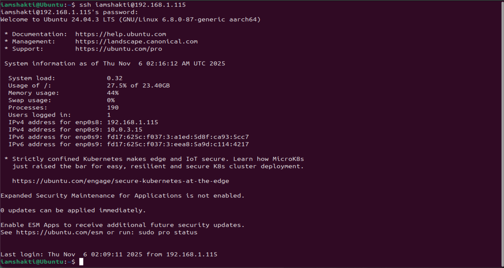

**Quick Navigation**  
[Week 1](week1.html) | [Week 2](week2.html) | [Week 3](week3.html) | [Week 4](week4.html) | [Week 5](week5.html) | [Week 6](week6.html) | [Week 7](week7.html)

# Week 1 — System Setup and Baseline Evidence
- Server: Ubuntu Server
- Workstation: Ubuntu Desktop
- Admin via SSH only.

**Server IP:** 192.168.1.115  
SSH:

Baseline evidence:

