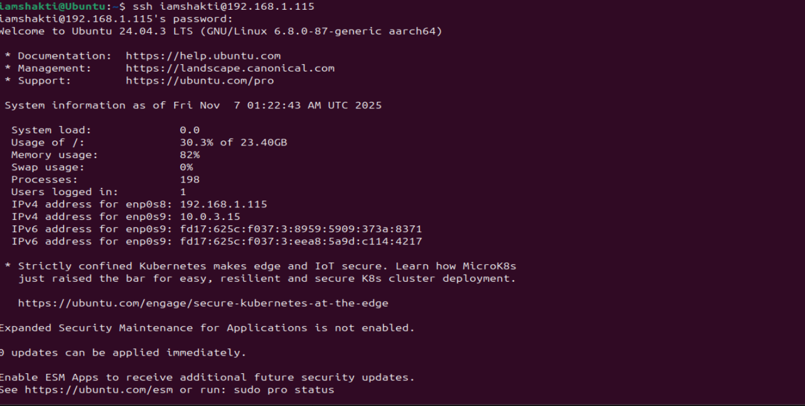
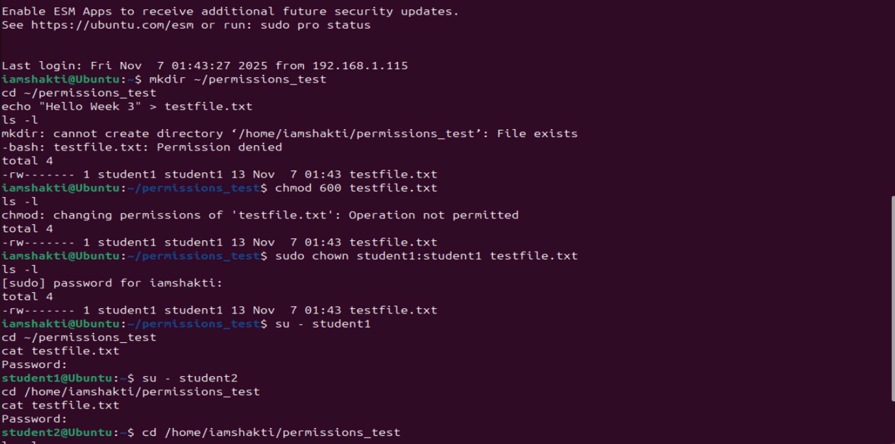
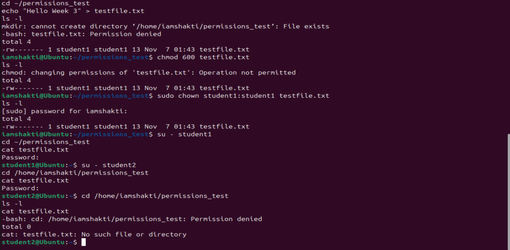

## Week 3 — File Management and Permissions

### Tasks Completed
- Created directory `permissions_test` and file `testfile.txt`
- Modified file permissions using `chmod`
- Changed ownership using `chown`
- Tested file access for `student1` and `student2`

### Week 3 Summary
In Week 3, I explored Linux file management and permissions.  
I created a directory and a file, then used `chmod` to restrict access so only the file owner could read and write to it.  
Using the `chown` command, I changed the ownership of the file to `student1`.  
When logged in as `student1`, I was able to read the file successfully, but `student2` received a **Permission denied** error.  
This exercise showed how Linux permissions (`rwx`) and ownership help secure files in a multi-user system.

### Evidence Screenshots

---
layout: default
title: Week 3
---

# Week 3

Content coming soon.
