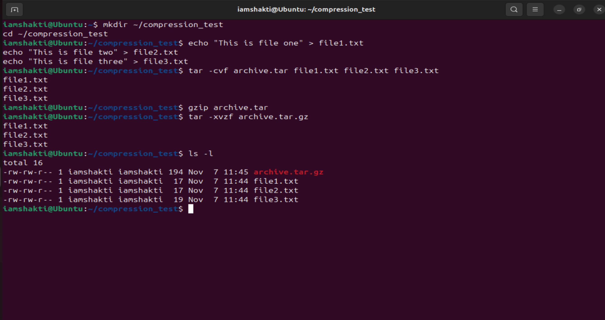

## Week 4 — File Compression and Archiving

### Tasks Completed
- Created test files (`file1.txt`, `file2.txt`, `file3.txt`)
- Archived files into `archive.tar` using the `tar` command
- Compressed the archive using `gzip` to create `archive.tar.gz`
- Extracted the archive to restore the original files
- Verified the contents using `ls -l`

### Week 4 Summary
In Week 4, I explored how to compress and archive files in Linux.  
I created three text files, combined them into a single archive using `tar`, and compressed it using `gzip`.  
After extracting the files, I confirmed that all the original files were restored successfully.  
This exercise demonstrated how file compression and archiving help reduce storage space and organize files efficiently.

### Evidence Screenshot

---
layout: default
title: Week 4
---

# Week 4

Content coming soon.
