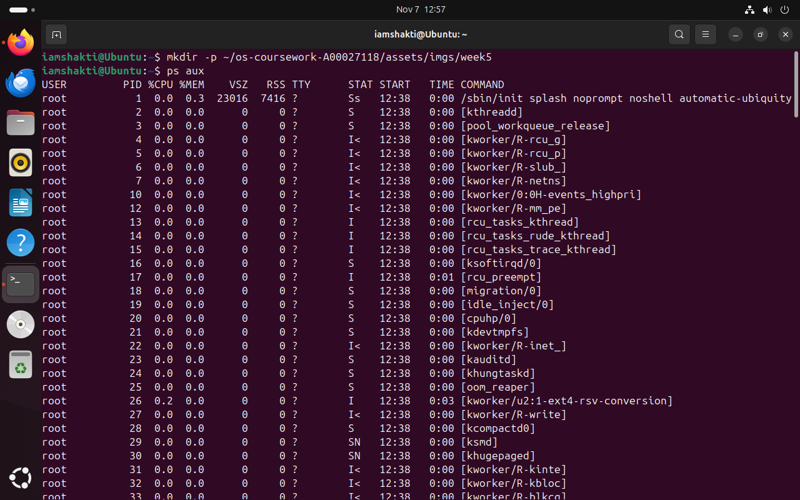
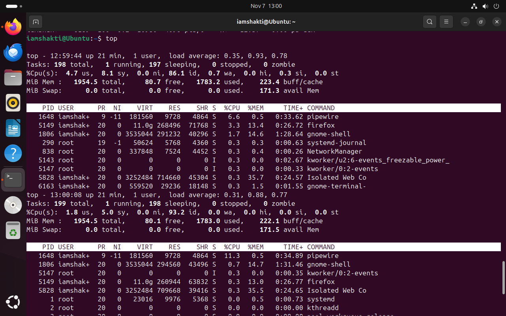
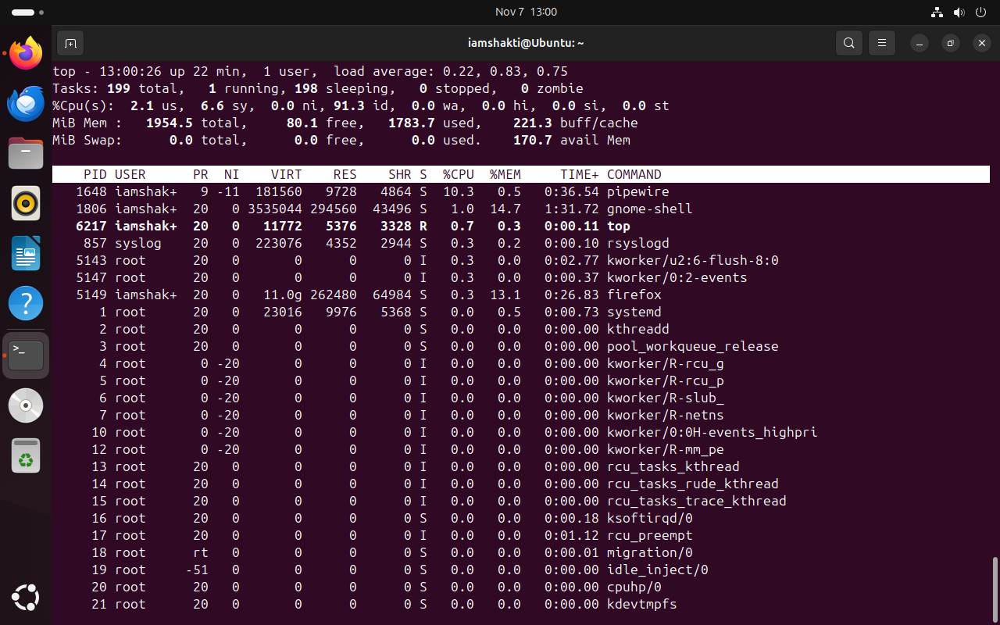

## Week 5 — Process Management

### Tasks Completed
- Listed all running processes using `ps aux`
- Monitored live system activity using `top`
- Started a background process with `sleep`
- Checked and killed a process using `jobs` and `kill`
- Verified process termination with `ps aux | grep sleep`

### Week 5 Summary
In Week 5, I explored Linux process management.  
Using `ps aux`, I viewed all running processes and learned how to identify system and user activities.  
With the `top` command, I monitored CPU and memory usage in real time.  
I then created a background process using `sleep 300`, viewed it with `jobs`, and terminated it using `kill`.  
Finally, I verified that the process was successfully terminated.  
This week helped me understand how to control and monitor processes in Linux effectively.

### Evidence Screenshots

