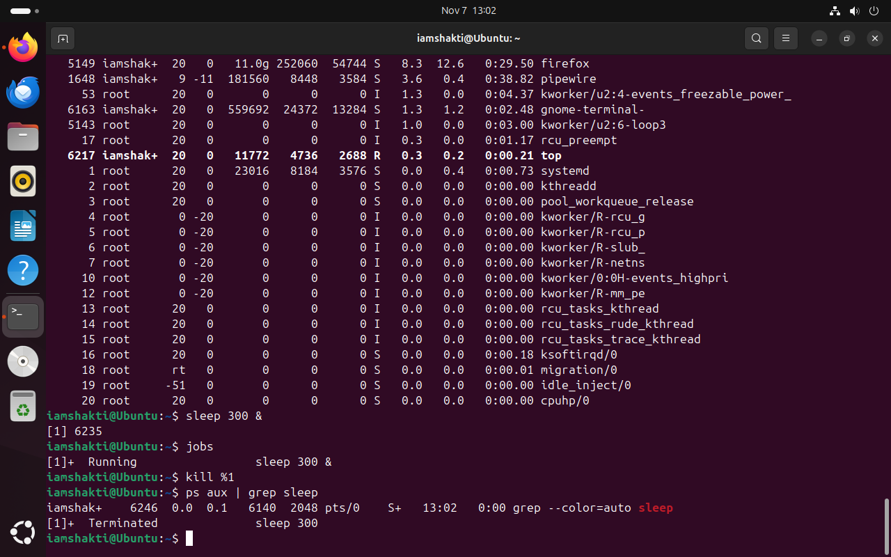

## Week 5 — Process Management

### Tasks Completed
- Listed all running processes using `ps aux`
- Monitored live system activity using `top`
- Started a background process with `sleep`
- Checked and killed a process using `jobs` and `kill`
- Verified process termination with `ps aux | grep sleep`

### Week 5 Summary
In Week 5, I learned how Linux manages running processes.  
Using `ps aux`, I viewed all active system and user processes, including their CPU and memory usage.  
I then explored real-time process monitoring with `top`, which updates dynamically.  
Next, I created a background process using `sleep 300`, checked it with `jobs`, and stopped it using `kill`.  
Finally, I confirmed that the process had ended successfully.  
This exercise helped me understand how administrators monitor and control processes in Linux effectively.

### Evidence Screenshots

---
layout: default
title: Week 5
---

# Week 5

Content coming soon.
