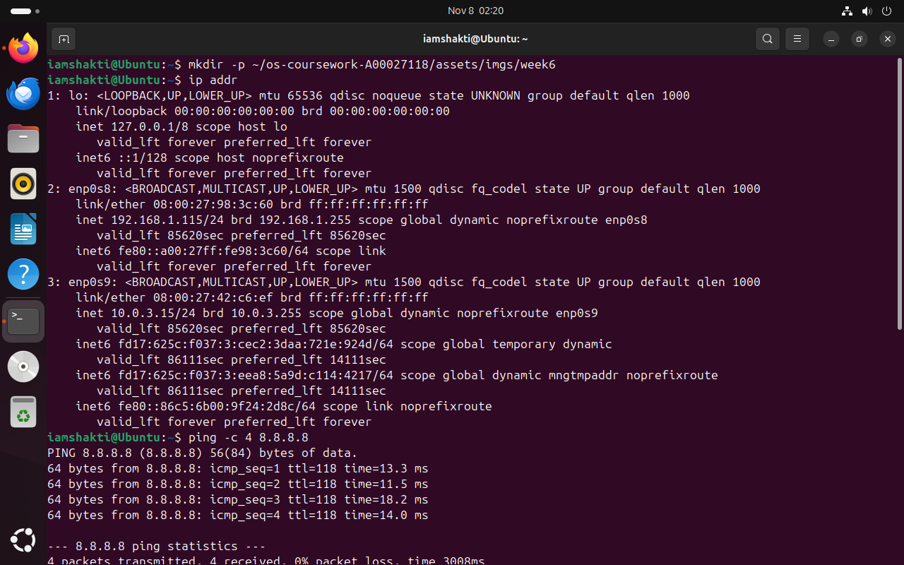
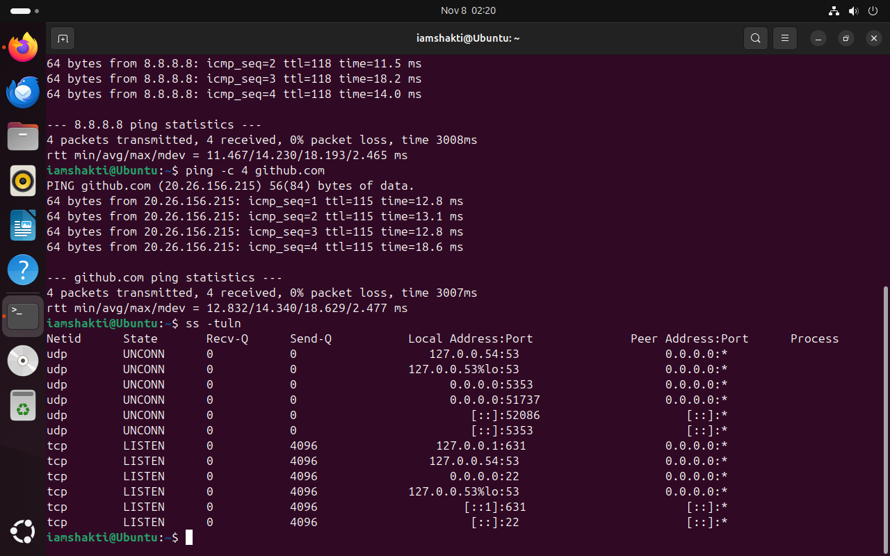

**Quick Navigation**  
[Week 1](week1.html) | [Week 2](week2.html) | [Week 3](week3.html) | [Week 4](week4.html) | [Week 5](week5.html) | [Week 6](week6.html) | [Week 7](week7.html)

## Week 6 — Network Connectivity and Services

### Tasks Completed

- Checked local network configuration using `ip addr`
- Verified external connectivity with `ping`
- Confirmed DNS resolution by pinging a hostname
- Listed listening network services using `ss -tuln`

### Week 6 Summary

In Week 6, I explored basic Linux networking tools used to verify connectivity and running services.
Using `ip addr`, I identified the IP addresses assigned to my Ubuntu system.  
I then ran `ping` to reach an external IP address and a domain name, confirming both internet
access and working DNS resolution.  
Finally, I used `ss -tuln` to list active listening ports and see which services were available
on the system. These steps helped me understand how to quickly diagnose common network issues.

### Evidence Screenshots

