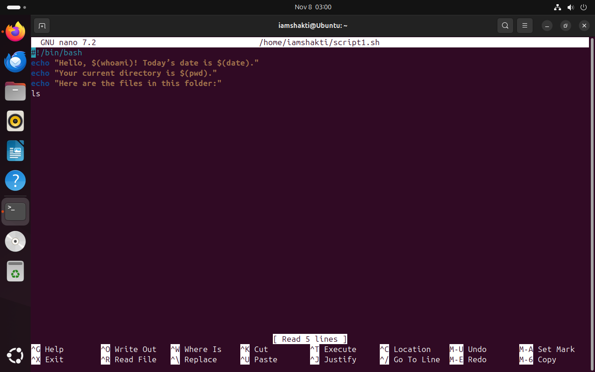
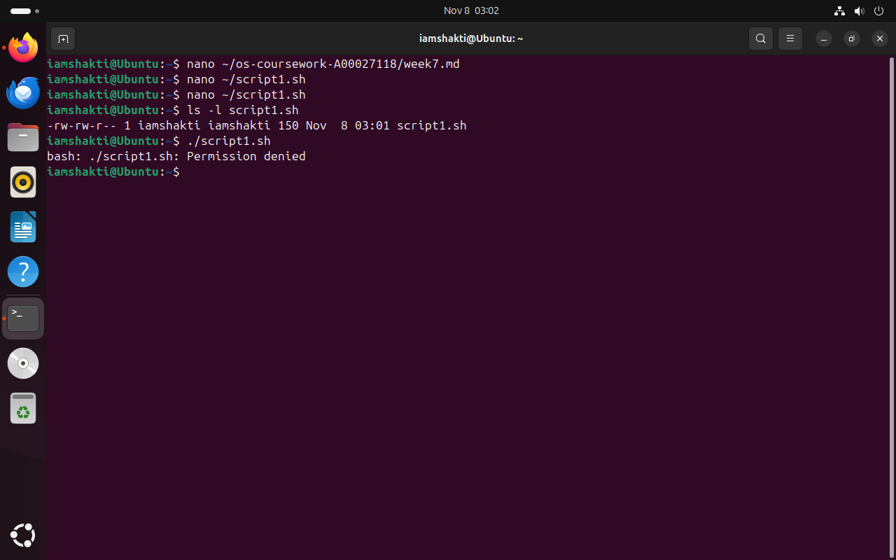
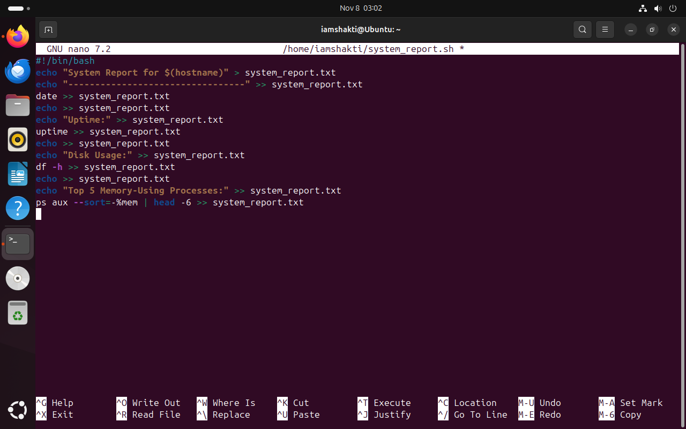
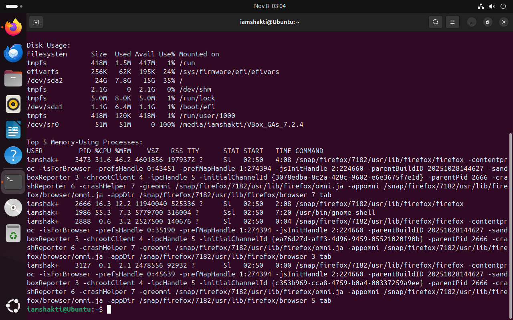

# Week 7 — (Topic Title)

- (Main point 1)
- (Main point 2)
- (Main point 3)

### Week 7 Summary
In Week 7, I explored _____.  
I practiced _____, learned how to _____, and verified _____ using Linux commands.  
This week helped me gain confidence in _____ and understand how _____ works.

### Evidence Screenshots
  

---
layout: default
title: Week 7
---

# Week 7

Content coming soon.
